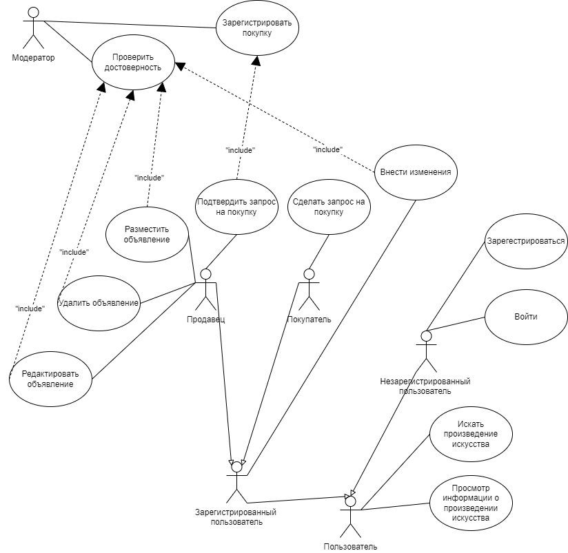
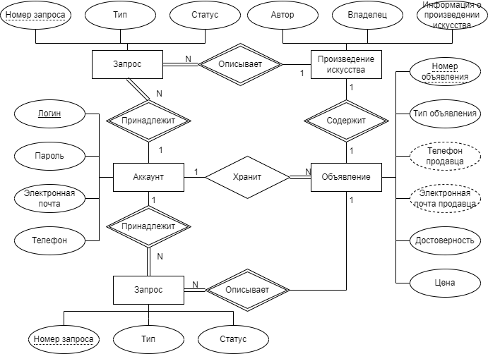

# WEB
## Торговая площадка и предоставление информации о произведениях искусства
### Краткое описание идеи проекта
Реализовать БД и интерфейс для взаимодействия с ней.

Проект предоставляет возможность получения актуальной и достоверной информации о произведениях искусства и их владельцах. Кроме этого, у пользователей есть возможность совершать покупку и продажу произведений искусства, находящихся у них в собственности. В проекте предусмотрено наличие незарегистрированных пользователей, зарегестрированных, которые могут взаимодействовать между собой в качестве продавца или покупателя, и модераторов, следящих за достоверностью и актуальностью поступающих запросов на изменение хранимой информации.

Незарегистрированные пользователи могут только просматривать информацию о произведениях искусства. Зарегистрированные могут просматривать информацию, отправлять запрос на внесение изменений в существующие данные о произведениях искусства, а также совершать покупку или продажу произведений искусства взаимодействуя с другими пользователями. Перед внесением изменений в базу данных по запросу пользователя или в результате совершения покупки\продажи, информация проверяется модератором.

### Краткое описание предметной области
Предметной областью являются произведения искусства. Существует множество произведений искусства и множество их владельцев. Произведения искусства могут принадлежать лицам, не использующим сервис, и зарегистрированным пользователям, в последнем случае предоставляется возможность взаимодействия с этим владельцем.

### Функционал

* Регистрация
* Выход из системы
* Просмотр существующих произведений
* Просмотр существущих объявлений
* Создание объявления
* Покупка произведения

### Use-case диаграмма

### ER-диаграмма сущностей

### Moodboard

[Click me](https://ru.pinterest.com/zhuravlevevgead/web-research/)

### Figma

[Click me](https://www.figma.com/file/L8IcmvDhYJ1lYLt7QRkZ9v/WEB?node-id=0%3A1&t=6ByQSyNKuAHDZszF-0)
